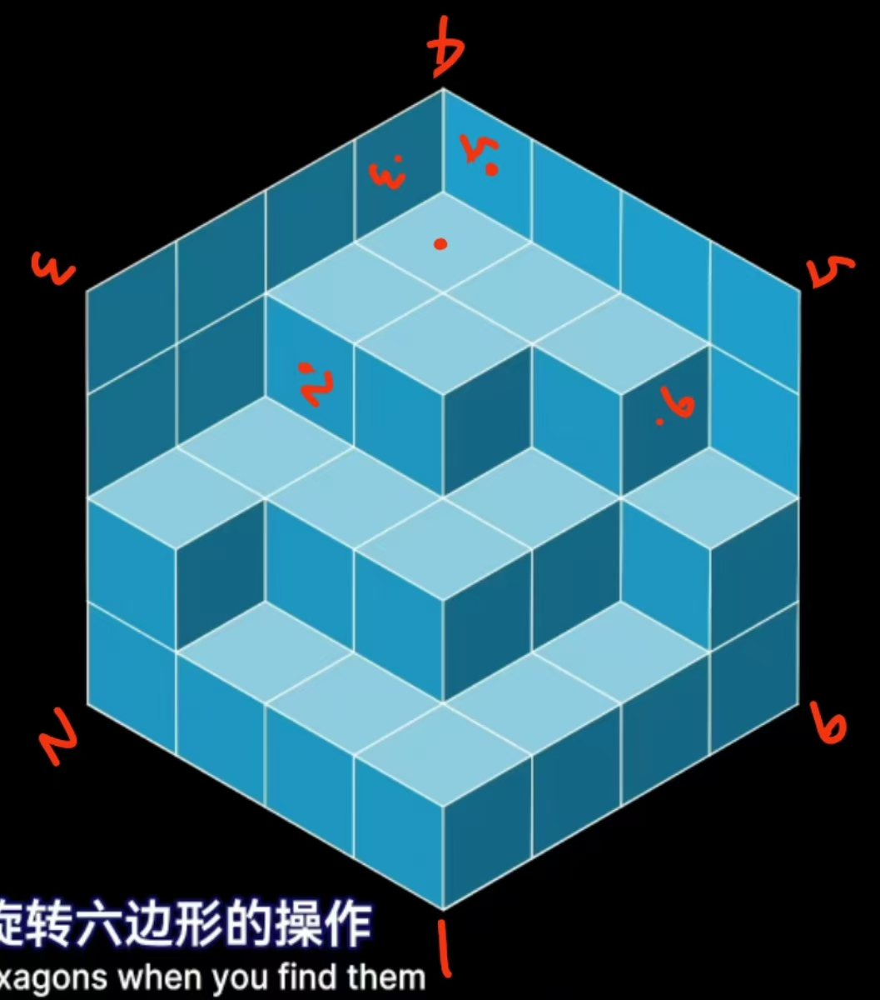
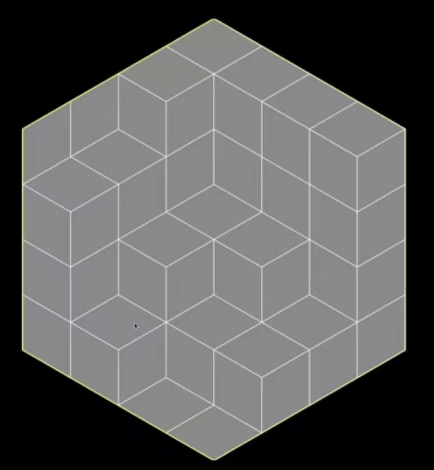

#### 前言

灵感来由：
1. https://www.bilibili.com/video/BV1Ga411d7Lx
2. https://www.bilibili.com/video/BV1B44y1D7m2
3. https://www.bilibili.com/video/BV1s5fZYdELc
4. 《纪念碑谷》
5. 《崩坏·星穹铁道》梦境迷钟、黄金替罪羊

开发环境：
1. C++
2. Visual Studio
3. Win32 API
4. Git
5. GitHub:https://github.com/sqzr2319/Tuozhu-Software

#### 简介

一个基于二维与三维间视错觉的解谜游戏。

核心思想：

上图是一个涂有三种颜色的二维图形。尝试旋转屏幕，每次旋转60度，在每个角度上，人眼可以将其识别为六个完全不同的三维图形。图中未标有数字的红点代表小人初始所在的位置，倘若在每个角度上分别加上各自方向的重力，则小人可以分别落到图中四个标有数字的红点所在的位置上，红点旁边的数字与图中观测角度的数字相对应。

而在不染色的图形中，不难发现，若对上图中标绿的正六边形旋转60度变成下图，则这个操作等价于在三维中移去这个正六边形所对应的立方体。反之亦然，再旋转60度等价于添加一个立方体。

这样，我们就可以设计一个二维与三维相结合的迷宫游戏。在游戏中，玩家可以通过旋转整个图形来改变三维状态下的重力、旋转小正六边形来移走或添加小立方体，从而走出迷宫。

为了添加游戏的趣味性，我们还可以在游戏中添加一些特殊的元素，包括但不限于：
1. 限制旋转小正六边形的次数
2. 限制小人依靠重力下落的次数（即限制旋转整个图形的次数）
3. 在地图中设置传送门（单向或双向/单次或多次）
4. 在地图中设置固定死亡点与受重力影响的炸弹，玩家触碰到这些物体时会死亡
5. 设置一个影分身，影分身与玩家初始位置相同，但重力方向相反，玩家在行进过程中不能与影分身重合
6. 在地图中设置奇迹宝珠，奇迹宝珠打开时会更改地图中一部分地区的重力（如将重力方向旋转60度）

#### 分工

1. 褚一枫：基础玩法与附加功能
2. 杨雨田：游戏界面、剧情、美工
3. 杨为钦：关卡设计

具体分工详见[分工表](分工表.xlsx)。

